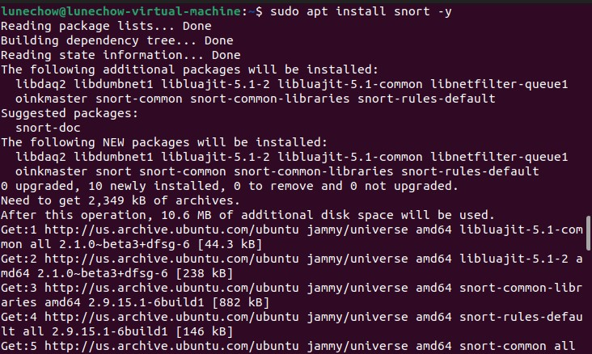
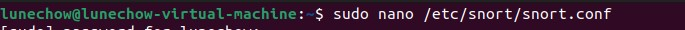
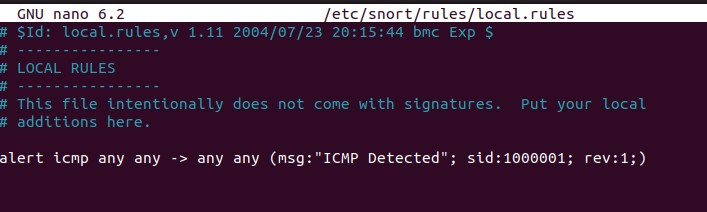
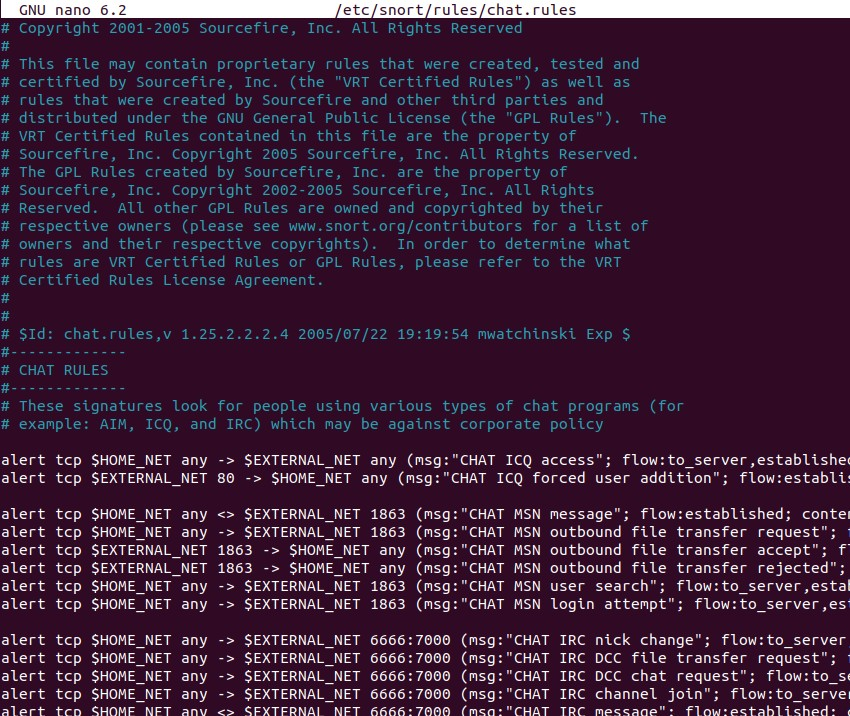
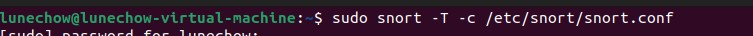
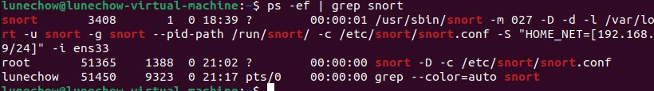

Step 1 : Install Snort

Install Snort directly using apt

	    sudo apt install snort -y

* Use the command *ip a*  to find your network interface
* When prompted, enter network interface and the HOME_NET IP range

Step 2 : Configure Snort

Open main configuration file to customize any Snort configurations, look over the file (scroll down the comment section to see preconfigured rules)

	   sudo nano /etc/snort/snort.conf

Step 3 : Update and Manage Snort Rules

To add your own rules, edit the local rule file

	    sudo nano /etc/snort/rules/local.rules

Add custom rules following the conventions for a rule header

	     action protocol IP_ADDRESS_SOURCE PORT 
	     -> IP_ADDRESS_DESTINATION PORT_DESTINATION 

* There are various rule's files found inside the rules directory. We know that one of the detection and prevention techniques in IDPS is policy-based; which makes sure that activities are compliant with company policy. The chat.rules file detects different types of chat programs being used that may be against corporate policy. 

* Rules can be configured to the specification of the user. They can alert, log, drop, or reject a packet. 

Step 4 : Test Snort Configuration

Test that Snort is running properly after configuring.

		   sudo snort -T -c /ect/snort/snort.conf

View validation to confirm correct configuration.

Step 5 : Running Snort in IDS Mode 

Monitor Traffic in IDS Mode

		   sudo snort -c /etc/snort/snort.cong -i INTERFACE

![]

* To exit, hit ctrl + c

Step 6: Viewing Snort Logs

Snort logs alerts in /var/log/snort. There are three files in my current directory: snort.alert, snort.alert.fast, and snort.log. Events that have triggered an alert are recorded in snort.alert and snort.alert.fast, the latter showing a brief one-line overview of the event. These alerts are triggered according to the specified rules. Since there have been no alerts, the files are empty. The processed packets can be located in the snort.log file. 

![[Pasted image 20251026204508.png]]

Step 8: Running Snort as a Daemon

To run in the background, specify the interface.

		   sudo snort -D -c /etc/snort/snort.conf -i INTERFACE

Use the *top* command to view the different processes in your system

To check the corresponding process, use the following command.

		   ps -ef | grep snort

* Use the *kill*  command and the process ID to stop the daemon

		   sudo kill -9 PID

		
